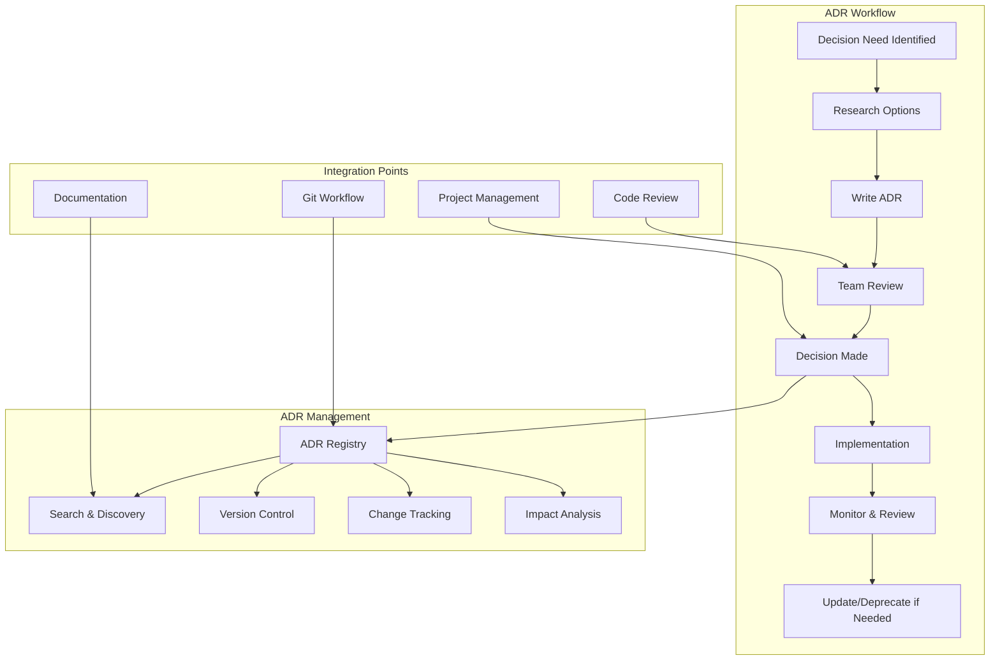
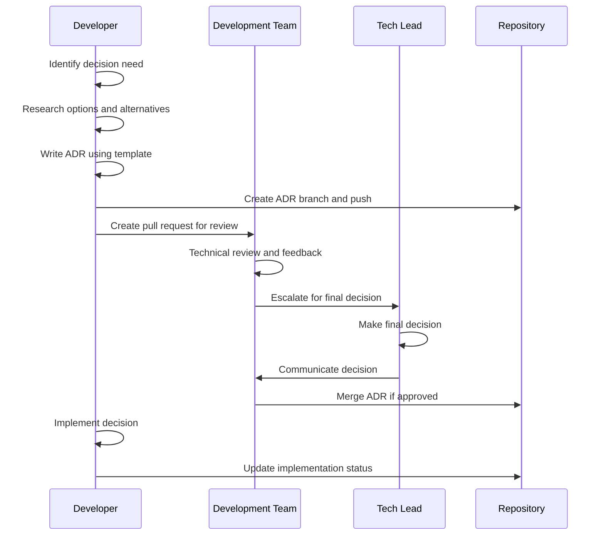
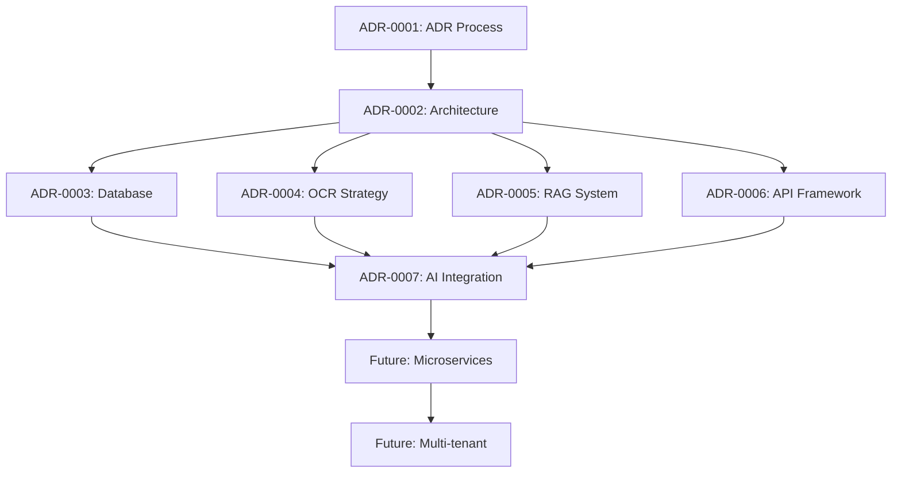

# Architectural Decision Records (ADRs) System Design

## Overview

This document establishes the Architectural Decision Records (ADR) system for the FineHero project, providing a systematic approach to documenting, tracking, and managing architectural decisions throughout the project lifecycle.

## ADR System Architecture

### System Components



### Directory Structure
```
docs/architecture/
├── adrs/                              # Architectural Decision Records
│   ├── 0001-record-template.md       # ADR-0001: Record Template
│   ├── 0002-project-initiation.md    # ADR-0002: Project Architecture
│   ├── 0003-database-choice.md       # ADR-0003: Database Technology
│   ├── 0004-ocr-strategy.md          # ADR-004: OCR Implementation
│   ├── 0005-rag-architecture.md      # ADR-005: RAG System Design
│   ├── 0006-api-framework.md         # ADR-006: API Framework Choice
│   ├── 0007-ai-service-integration.md # ADR-007: AI Service Integration
│   └── README.md                     # ADR Index and navigation
├── diagrams/                          # Architecture diagrams
│   ├── system-architecture.md        # System overview diagrams
│   ├── component-interactions.md     # Component interaction diagrams
│   └── data-flow.md                  # Data flow diagrams
├── specifications/                    # Detailed technical specs
└── decisions/                         # Decision tracking and management
    ├── pending/                       # Decisions under consideration
    ├── active/                        # Active decisions
    └── deprecated/                    # Superseded decisions
```

## FineHero Key Architectural Decisions

### ADR-0001: Record Template and Process

**Status:** Accepted  
**Date:** 2025-11-11  
**Deciders:** FineHero Development Team  

**Context:** Establish standardized process for documenting architectural decisions to maintain system quality and facilitate knowledge transfer.

**Decision:** Implement ADR system using lightweight Markdown-based approach integrated with Git workflow.

**Rationale:**
- Lightweight and easy to maintain
- Integrates well with version control
- Familiar format for development team
- Supports automated processing and linking

**Implications:**
- All major architectural decisions must be documented as ADRs
- ADRs required for technology choices, design patterns, and significant changes
- Integration with code review and pull request process

### ADR-0002: Project Architecture and Technology Stack

**Status:** Accepted  
**Date:** 2025-11-11  
**Deciders:** FineHero Development Team  

**Context:** Establish core technology stack and architectural approach for FineHero traffic fine contestation system.

**Decision:** Adopt FastAPI + Python backend with modular microservices architecture, supporting both API and CLI interfaces.

**Technology Stack:**
- **Backend:** Python 3.8+ with FastAPI framework
- **Database:** SQLite (development) → PostgreSQL (production)
- **Document Processing:** pytesseract, easyocr, pdfplumber
- **AI/ML:** Google Generative AI, HuggingFace embeddings
- **Vector Storage:** FAISS for similarity search
- **CLI:** Python argparse-based interface
- **Deployment:** Docker containers with Docker Compose

**Rationale:**
- FastAPI provides automatic API documentation and high performance
- Python ecosystem rich for AI/ML and document processing
- Modular architecture supports feature growth and maintenance
- SQLite simplifies development, PostgreSQL scales for production

**Implications:**
- API-first design enables multiple client interfaces
- Document processing pipeline must be robust and fault-tolerant
- AI integration requires proper API key management and rate limiting
- Database migration strategy needed for production deployment

### ADR-0003: Database Technology and Migration Strategy

**Status:** Accepted  
**Date:** 2025-11-11  
**Deciders:** FineHero Development Team  

**Context:** Choose database technology and establish migration strategy from development to production.

**Decision:** Use SQLite for development and local testing, migrate to PostgreSQL for production deployment.

**Database Strategy:**
- **Development:** SQLite with file-based storage for simplicity
- **Staging/Production:** PostgreSQL with connection pooling
- **Migration:** Automated migration scripts with rollback support
- **Schema Versioning:** SQLAlchemy migrations for schema evolution

**Rationale:**
- SQLite eliminates setup complexity for development
- PostgreSQL provides better concurrency and scalability for production
- SQLAlchemy ORM provides database abstraction and migration support
- Connection pooling essential for API scalability

**Implications:**
- Database connection configuration must support multiple environments
- Migration scripts tested thoroughly before production deployment
- Connection pooling and performance optimization required for production
- Backup and recovery procedures specific to PostgreSQL needed

### ADR-0004: OCR and Document Processing Strategy

**Status:** Accepted  
**Date:** 2025-11-11  
**Deciders:** FineHero Development Team  

**Context:** Design OCR and document processing pipeline to handle various PDF formats and layouts.

**Decision:** Implement multi-stage OCR pipeline with fallback mechanisms and quality assessment.

**OCR Strategy:**
- **Primary:** pdfplumber for text-based PDFs
- **Fallback 1:** pytesseract for image-based PDFs
- **Fallback 2:** easyocr for complex layouts
- **Quality Scoring:** Automatic assessment of extraction quality
- **Error Handling:** Graceful degradation with user notification

**Rationale:**
- Portuguese legal documents vary in format and quality
- Multiple OCR engines increase success rate and accuracy
- Fallback strategy reduces user frustration and support burden
- Quality scoring enables continuous improvement

**Implications:**
- Tesseract OCR must be properly installed and configured
- EasyOCR model downloads managed appropriately
- Processing time acceptable for user experience (< 30 seconds)
- Error logging and monitoring for OCR pipeline health

### ADR-0005: RAG System Architecture

**Status:** Accepted  
**Date:** 2025-11-11  
**Deciders:** FineHero Development Team  

**Context:** Design Retrieval-Augmented Generation system for Portuguese legal document search and retrieval.

**RAG Architecture:**
- **Document Storage:** FAISS vector database with metadata
- **Embeddings:** sentence-transformers for semantic similarity
- **Chunking:** Recursive text splitting with overlap
- **Metadata:** Quality scores, jurisdiction, document type
- **Retrieval:** Hybrid search (semantic + keyword filtering)

**Rationale:**
- FAISS provides efficient similarity search for legal documents
- Portuguese legal domain requires domain-specific embeddings
- Metadata enrichment improves retrieval relevance
- Quality scoring enables ranking and filtering

**Implications:**
- Vector store initialization and maintenance procedures needed
- Embedding generation optimized for Portuguese legal content
- Regular knowledge base updates with quality validation
- Performance monitoring for retrieval accuracy and speed

### ADR-0006: API Framework and Design

**Status:** Accepted  
**Date:** 2025-11-11  
**Deciders:** FineHero Development Team  

**Context:** Choose API framework and establish RESTful API design standards.

**API Framework Decision:**
- **Framework:** FastAPI with automatic OpenAPI/Swagger documentation
- **Design Pattern:** Resource-based REST API with consistent error handling
- **Authentication:** API key authentication (expandable to OAuth)
- **Validation:** Pydantic models for request/response validation
- **Documentation:** Auto-generated OpenAPI spec with examples

**Rationale:**
- FastAPI provides excellent performance and automatic documentation
- RESTful design supports multiple client types
- Pydantic ensures data validation and serialization
- OpenAPI documentation reduces client integration time

**Implications:**
- All endpoints follow consistent response format
- Error responses include helpful debugging information
- API versioning strategy for backward compatibility
- Rate limiting and authentication middleware implemented

### ADR-0007: AI Service Integration and Defense Generation

**Status:** Accepted  
**Date:** 2025-11-11  
**Deciders:** FineHero Development Team  

**Context:** Integrate AI services for automated defense generation using legal knowledge base.

**AI Integration Strategy:**
- **Service:** Google Generative AI for text generation
- **Prompt Engineering:** Template-based prompts with legal context
- **Context Integration:** RAG system provides relevant legal precedents
- **Quality Control:** Human oversight for critical defenses
- **Fallback:** Template-based defenses when AI unavailable

**Rationale:**
- Google Generative AI provides high-quality Portuguese text generation
- Template-based approach ensures consistency and legal compliance
- RAG integration grounds AI responses in actual legal precedents
- Human oversight maintains quality and reduces risk

**Implications:**
- API key management and rate limiting essential
- Prompt templates must be regularly reviewed and updated
- Legal accuracy validation processes required
- Cost monitoring for AI service usage

## ADR Process and Workflow

### When to Create an ADR

**Required ADR Triggers:**
- Technology stack changes (databases, frameworks, libraries)
- Architecture pattern changes (microservices, monolith, etc.)
- Major feature implementation affecting system design
- Integration with external services or APIs
- Performance or scalability architecture decisions
- Security architecture changes
- Deployment or infrastructure changes

**Optional ADR Triggers:**
- Minor technology choices affecting multiple components
- Development process or workflow changes
- Documentation or tooling decisions
- Performance optimizations with architectural impact

### ADR Creation Process



### ADR Review and Approval

#### Review Criteria
1. **Technical Accuracy**: Decision based on sound technical reasoning
2. **Alternative Analysis**: All reasonable alternatives considered
3. **Risk Assessment**: Risks identified and mitigation strategies provided
4. **Implementation Plan**: Clear path for implementation
5. **Impact Analysis**: System-wide impacts identified and addressed

#### Decision Making Process
1. **Initial Review**: Team peer review for technical accuracy
2. **Impact Assessment**: Review for system-wide implications
3. **Stakeholder Review**: Product and business stakeholder input
4. **Final Decision**: Tech lead or architecture team approval
5. **Documentation**: Record decision and communicate to team

#### Decision Outcomes
- **Accepted**: Decision approved for implementation
- **Rejected**: Decision not approved with feedback
- **Superseded**: Existing ADR updated with new decision
- **Deferred**: Decision postponed for later consideration

## Integration with Development Workflow

### Git Workflow Integration

#### Branch Naming Convention
```bash
# ADRs and related development
adr-005-rag-implementation
feature/rag-system
bugfix/ocr-fallback-issue
docs/api-endpoint-documentation
```

#### Commit Message Integration
```bash
# ADR-related commits
git commit -m "adr: add ADR-008 for microservices migration

- Documents rationale for microservices adoption
- Defines migration strategy and timeline
- Includes impact analysis for existing components"

# Implementation commits
git commit -m "feat: implement ADR-008 microservices architecture

- Refactors monolithic backend into services
- Adds API gateway for service routing
- Implements service discovery and health checks"

# Documentation updates
git commit -m "docs: update deployment guide per ADR-009

- Adds Kubernetes deployment procedures
- Updates monitoring configuration
- Includes rollback procedures for service updates"
```

#### Pull Request Integration
```bash
# PR template includes ADR references
# Pull Request Description Template:

## Architectural Decision
This change implements [ADR-XXX: Title](link-to-adr)

## Technical Implementation
- [ ] ADR requirements satisfied
- [ ] Architecture diagram updated
- [ ] Related documentation updated

## Testing
- [ ] Unit tests for new components
- [ ] Integration tests for service interactions
- [ ] Performance tests for scalability

## Documentation
- [ ] API documentation updated
- [ ] Deployment procedures updated
- [ ] User guides updated
```

### Code Review Integration

#### Review Checklist for ADR Implementation
- [ ] Implementation matches ADR specifications
- [ ] No architecture drift from documented decisions
- [ ] Performance implications addressed
- [ ] Security considerations implemented
- [ ] Documentation updated accordingly
- [ ] Tests cover architectural changes

#### Architecture Review Role
```python
# Example architecture review role assignment
class ArchitectureReviewer:
    def review_pull_request(self, pr):
        """
        Review PR for architectural compliance with ADRs.
        """
        adrs_affected = self.identify_relevant_adrs(pr.changes)
        
        for adr in adrs_affected:
            if not self.compliance_check(pr, adr):
                return ReviewResult.REJECTED
            
        return ReviewResult.APPROVED
```

## ADR Management and Maintenance

### ADR Status Management

#### Status Definitions
- **Draft**: Initial version, not ready for review
- **Proposed**: Submitted for team review
- **Accepted**: Approved for implementation
- **Superseded**: Replaced by newer ADR
- **Deprecated**: No longer applicable
- **Rejected**: Not approved

#### Status Tracking
```markdown
<!-- ADR Status Badge -->


```

### ADR Registry and Discovery

#### Search and Navigation
```yaml
# ADR registry structure for automated processing
registry:
  - id: "ADR-0001"
    title: "Record Template and Process"
    status: "Accepted"
    date: "2025-11-11"
    tags: ["process", "documentation", "adr"]
    components: ["all"]
    related_adrs: []
    
  - id: "ADR-0002"
    title: "Project Architecture and Technology Stack"
    status: "Accepted"
    date: "2025-11-11"
    tags: ["architecture", "technology-stack"]
    components: ["backend", "database", "ai-services"]
    related_adrs: ["ADR-0003", "ADR-0006"]
```

#### Automated Links and References
```bash
# Script to generate ADR index and cross-references
#!/bin/bash
# generate_adr_index.sh

echo "# FineHero Architectural Decision Records" > docs/architecture/adrs/README.md
echo "" >> docs/architecture/adrs/README.md
echo "## Decision Index" >> docs/architecture/adrs/README.md
echo "" >> docs/architecture/adrs/README.md

for adr in docs/architecture/adrs/*.md; do
    if [[ $adr != *"README.md"* ]]; then
        title=$(grep "^# ADR-" "$adr" | head -1)
        status=$(grep "Status:" "$adr" | cut -d: -f2 | xargs)
        echo "- $title - Status: $status" >> docs/architecture/adrs/README.md
    fi
done
```

### Impact Analysis and Dependencies

#### Decision Dependencies


#### Change Impact Assessment
```markdown
## Impact Analysis Template

### System Components Affected
- [ ] Backend API layer
- [ ] Database schema and migrations
- [ ] Document processing pipeline
- [ ] AI service integration
- [ ] Deployment and infrastructure
- [ ] Monitoring and logging

### Breaking Changes
- [ ] API compatibility
- [ ] Database schema changes
- [ ] Configuration requirements
- [ ] Deployment procedures

### Migration Requirements
- [ ] Database migration scripts
- [ ] Configuration updates
- [ ] Environment setup changes
- [ ] Documentation updates
```

## Quality Assurance and Metrics

### ADR Quality Metrics
- **Completeness**: All required sections populated
- **Accuracy**: Technical information verified against implementation
- **Clarity**: Clear writing appropriate for target audience
- **Relevance**: Decision scope appropriate and focused
- **Actionability**: Clear implementation guidance provided

### Success Metrics
- **Adoption Rate**: 90%+ of relevant decisions documented as ADRs
- **Review Coverage**: 100% of ADRs reviewed by at least 2 team members
- **Implementation Success**: 95%+ of accepted ADRs successfully implemented
- **Knowledge Transfer**: New team members can understand architecture via ADRs
- **Decision Reversal Rate**: <10% of decisions reversed within 6 months

### Review Schedule
- **Weekly**: New ADRs reviewed within 1 week of submission
- **Monthly**: Review ADRs for relevance and accuracy
- **Quarterly**: Audit ADR coverage and process effectiveness
- **Annually**: Review ADR template and process improvements

---

**System Version:** 1.0  
**Last Updated:** 2025-11-11T15:50:06.494Z  
**Owner:** Architecture Team  
**Review Frequency:** Quarterly