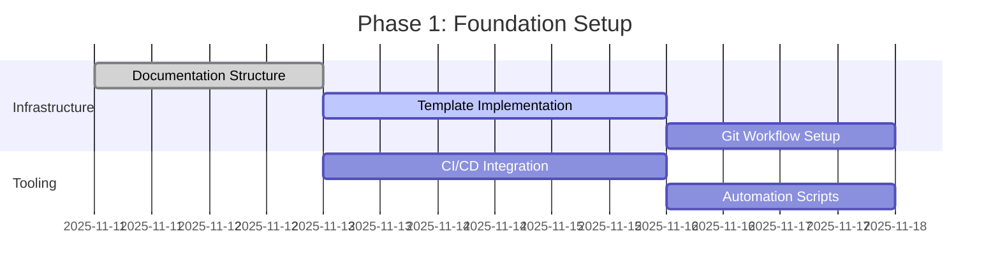

# Implementation Plan and Integration Strategy

## Overview

This document provides a comprehensive implementation roadmap for establishing version-controlled documentation as the single source of truth for the FineHero project. It outlines integration strategies, rollout procedures, and success metrics for the documentation enhancement plan.

## Implementation Roadmap

### Phase 1: Foundation Setup (Weeks 1-2)

#### Week 1: Environment and Infrastructure


**Deliverables:**
- [ ] Documentation directory structure created
- [ ] Template library populated and tested
- [ ] Git workflow established with branch strategy
- [ ] CI/CD pipelines configured for documentation
- [ ] Documentation automation scripts implemented

**Success Criteria:**
- All documentation templates accessible and functional
- Git workflow tested with sample documentation
- CI/CD pipelines validate documentation builds
- Team can create and manage documentation using new tools

#### Week 2: Initial Documentation Migration
**Tasks:**
- [ ] Migrate existing documentation to new structure
- [ ] Create missing documentation using templates
- [ ] Establish cross-linking and references
- [ ] Validate documentation accuracy and completeness
- [ ] Conduct initial team training

**Deliverables:**
- [ ] All existing documentation migrated to new structure
- [ ] Missing documentation gaps identified and filled
- [ ] Documentation navigation and discovery working
- [ ] Team trained on new documentation processes

### Phase 2: Core Documentation Implementation (Weeks 3-6)

#### Week 3-4: API and Technical Documentation
**Priority Tasks:**
- [ ] Complete API documentation for all existing endpoints
- [ ] Create technical specifications for major components
- [ ] Document database schema and migrations
- [ ] Implement OpenAPI/Swagger integration
- [ ] Create troubleshooting guides for common issues

**Success Metrics:**
- 100% of API endpoints documented with examples
- Technical specifications for all major components
- Database documentation complete with migration history
- Troubleshooting guides covering 90% of common issues

#### Week 5-6: Architectural and Workflow Documentation
**Priority Tasks:**
- [ ] Create Architectural Decision Records (ADRs) for existing decisions
- [ ] Document development workflow and standards
- [ ] Create deployment and operations documentation
- [ ] Establish security and compliance documentation
- [ ] Implement documentation quality assurance processes

**Success Metrics:**
- All major architectural decisions documented as ADRs
- Development workflow documentation complete
- Deployment procedures tested in all environments
- Security documentation meets compliance requirements

### Phase 3: Advanced Features and Optimization (Weeks 7-10)

#### Week 7-8: Quality and Automation Enhancement
**Priority Tasks:**
- [ ] Implement automated documentation validation
- [ ] Create documentation search and discovery tools
- [ ] Establish documentation metrics and monitoring
- [ ] Implement documentation versioning and change tracking
- [ ] Create documentation improvement feedback loop

#### Week 9-10: Integration and Polish
**Priority Tasks:**
- [ ] Integrate documentation with IDE and development tools
- [ ] Create documentation deployment and hosting strategy
- [ ] Implement documentation accessibility and internationalization
- [ ] Establish documentation maintenance and update procedures
- [ ] Conduct comprehensive documentation audit and review

## Integration Strategy

### 1. Git Workflow Integration

#### Branch Strategy for Documentation
```bash
# Documentation development workflow
main                          # Production documentation
├── docs/enhancement/         # Documentation enhancement work
├── docs/api-v1/             # API documentation for v1
├── docs/architecture/        # Architecture documentation
└── docs/operations/          # Operational documentation

# Feature documentation workflow
feature/docs-new-endpoint     # Documentation for new API endpoint
├── docs/api/endpoints/       # Endpoint documentation
├── docs/examples/           # Code examples
└── docs/testing/            # Testing documentation
```

#### Commit Message Integration
```bash
# Documentation-specific commit patterns
git commit -m "docs: update API documentation for defense generation

- Add POST /api/v1/defenses/{fine_id} endpoint
- Include authentication and rate limiting details
- Add Python and JavaScript code examples
- Update OpenAPI specification
Refs: ADR-007"

git commit -m "adr: document AI service integration decision

- Records decision to use Google Generative AI
- Documents fallback and error handling strategy
- Includes cost and performance considerations
Closes: #123"

git commit -m "docs: update deployment procedures per ADR-009

- Adds Kubernetes deployment configuration
- Updates monitoring and alerting setup
- Includes rollback procedures
See: docs/deployment/production.md"
```

#### Pull Request Integration
**Documentation PR Template:**
```markdown
## Documentation Changes
- [ ] API documentation updated
- [ ] Code examples tested and working
- [ ] Technical specifications updated
- [ ] Deployment procedures updated
- [ ] Troubleshooting guide updated

## Related ADRs
- [ ] ADR linked or updated
- [ ] Architecture diagrams updated
- [ ] Design decisions documented

## Testing
- [ ] Code examples verified
- [ ] Links validated
- [ ] Cross-references checked
- [ ] Style guide compliance verified

## Review Checklist
- [ ] Technical accuracy verified
- [ ] Completeness checked
- [ ] Clarity and readability confirmed
- [ ] Integration with existing docs validated
```

### 2. Code Integration

#### Documentation as Code Approach
```python
# docstrings_to_docs.py - Automated docstring extraction
import inspect
import ast
from pathlib import Path
from typing import List, Dict

def extract_documentation_from_code():
    """Extract documentation from Python source code."""
    docs_dir = Path("docs/api")
    backend_dir = Path("backend")
    
    for py_file in backend_dir.rglob("*.py"):
        if "__pycache__" in str(py_file):
            continue
            
        module_docs = extract_module_docs(py_file)
        if module_docs:
            generate_api_docs(py_file, module_docs, docs_dir)

def extract_module_docs(file_path: Path) -> Dict:
    """Extract docstrings and comments from Python module."""
    with open(file_path) as f:
        tree = ast.parse(f.read())
    
    docs = {
        "classes": {},
        "functions": {},
        "modules": inspect.getdoc(tree) or ""
    }
    
    for node in ast.walk(tree):
        if isinstance(node, ast.ClassDef):
            docs["classes"][node.name] = {
                "doc": inspect.getdoc(node),
                "methods": extract_method_docs(node)
            }
        elif isinstance(node, ast.FunctionDef):
            docs["functions"][node.name] = inspect.getdoc(node)
    
    return docs
```

#### IDE Integration
```json
// .vscode/settings.json - VS Code workspace settings
{
    "python.analysis.typeCheckingMode": "basic",
    "python.linting.enabled": true,
    "python.linting.flake8Enabled": true,
    "python.linting.blackEnabled": true,
    "python.formatting.provider": "black",
    
    // Documentation integration
    "markdown.preview.breaks": true,
    "markdown.preview.linkify": true,
    "markdown.preview.typographer": true,
    "markdown.extension.toc.unorderedList.marker": "-",
    
    // File associations
    "files.associations": {
        "*.md": "markdown",
        "*.mdx": "markdown",
        "*.adoc": "asciidoc"
    },
    
    // Documentation workspace
    "search.exclude": {
        "**/.git": true,
        "**/docs/generated": true,
        "**/node_modules": true,
        "**/bower_components": true
    }
}
```

### 3. Automation and Tooling Integration

#### Documentation Generation Pipeline
```yaml
# .github/workflows/docs.yml
name: Documentation

on:
  push:
    branches: [ main, develop ]
    paths: 
      - 'docs/**'
      - 'backend/**/*.py'
      - 'backend/**/*.md'
  pull_request:
    paths: 
      - 'docs/**'
      - 'backend/**/*.py'

jobs:
  validate:
    runs-on: ubuntu-latest
    steps:
    - uses: actions/checkout@v3
    
    - name: Set up Python
      uses: actions/setup-python@v3
      with:
        python-version: '3.8'
    
    - name: Install dependencies
      run: |
        pip install -r requirements-docs.txt
        pip install -r backend/requirements.txt
    
    - name: Validate documentation
      run: |
        python scripts/validate_docs.py
        python scripts/check_links.py
        python scripts/generate_api_docs.py
        python scripts/validate_code_examples.py
    
    - name: Generate API documentation
      run: |
        cd backend
        python -m sphinx -b html docs docs/_build/html
    
    - name: Deploy to staging
      if: github.ref == 'refs/heads/main'
      run: |
        aws s3 sync docs/_build/html s3://finehero-docs-staging/
        aws cloudfront create-invalidation --distribution-id ${{ secrets.CLOUDFRONT_ID }} --paths "/*"
```

#### Documentation Validation Scripts
```python
#!/usr/bin/env python3
# scripts/validate_docs.py

import subprocess
import sys
from pathlib import Path
import re

def validate_markdown_quality():
    """Validate markdown files for quality standards."""
    issues = []
    
    for md_file in Path("docs").rglob("*.md"):
        if "node_modules" in str(md_file):
            continue
            
        with open(md_file) as f:
            content = f.read()
        
        # Check for broken links
        broken_links = find_broken_links(content, md_file.parent)
        if broken_links:
            issues.extend([f"{md_file}: {link}" for link in broken_links])
        
        # Check for missing frontmatter
        if not has_required_frontmatter(content):
            issues.append(f"{md_file}: Missing required frontmatter")
        
        # Check for code example syntax
        if not validate_code_examples(content):
            issues.append(f"{md_file}: Invalid code example syntax")
    
    return issues

def find_broken_links(content: str, base_path: Path) -> List[str]:
    """Find broken internal links in markdown content."""
    link_pattern = r'\[([^\]]+)\]\(([^)]+)\)'
    links = re.findall(link_pattern, content)
    
    broken = []
    for text, url in links:
        if url.startswith('http'):
            continue  # Skip external links
        
        # Handle relative links
        link_path = base_path / url
        if not link_path.exists() and not link_path.with_suffix('.md').exists():
            broken.append(url)
    
    return broken

def validate_code_examples(content: str) -> bool:
    """Validate code examples for syntax."""
    code_blocks = re.findall(r'```(\w+)?\n(.*?)\n```', content, re.DOTALL)
    
    for lang, code in code_blocks:
        if lang == 'python':
            try:
                compile(code, '<string>', 'exec')
            except SyntaxError:
                return False
        # Add validation for other languages as needed
    
    return True
```

### 4. Deployment and Hosting Strategy

#### Documentation Hosting Options

**Option 1: GitHub Pages (Recommended for Open Source)**
```yaml
# .github/workflows/deploy-docs.yml
name: Deploy Documentation

on:
  push:
    branches: [ main ]
    paths: [ 'docs/**' ]

jobs:
  deploy:
    runs-on: ubuntu-latest
    steps:
    - uses: actions/checkout@v3
    
    - name: Setup Node.js
      uses: actions/setup-node@v3
      with:
        node-version: '16'
    
    - name: Install Docusaurus
      run: npm install
    
    - name: Build documentation
      run: npm run build
    
    - name: Deploy to GitHub Pages
      uses: peaceiris/actions-gh-pages@v3
      with:
        github_token: ${{ secrets.GITHUB_TOKEN }}
        publish_dir: ./build
```

**Option 2: AWS S3 + CloudFront (Recommended for Production)**
```bash
#!/bin/bash
# scripts/deploy_docs.sh

set -e

# Build documentation
echo "Building documentation..."
cd docs
npm run build

# Deploy to S3
echo "Deploying to S3..."
aws s3 sync build/ s3://finehero-docs-prod/ \
  --delete \
  --content-type "text/html" \
  --exclude "*.html" \
  --cache-control "public, max-age=31536000"

# Invalidate CloudFront cache
echo "Invalidating CloudFront cache..."
aws cloudfront create-invalidation \
  --distribution-id $CLOUDFRONT_DISTRIBUTION_ID \
  --paths "/*"

echo "Documentation deployed successfully!"
```

#### Version Control Strategy
```bash
# Documentation versioning approach
main                          # Latest stable documentation
├── v1.0/                     # Version-specific documentation
├── v1.1/                     # New version branches
└── current/ -> main          # Symbolic link to current version

# Documentation tags
git tag docs-v1.0.0
git tag docs-v1.1.0
git tag docs-latest           # Points to most recent stable docs
```

## Rollout and Adoption Strategy

### 1. Team Training and Onboarding

#### Documentation Workshop Agenda
```
# FineHero Documentation Workshop

## Agenda (2 hours)
1. Documentation Overview (15 min)
   - New documentation structure
   - Template usage
   - Quality standards

2. Hands-on Training (60 min)
   - Creating API documentation
   - Writing ADRs
   - Using templates

3. Workflow Integration (30 min)
   - Git workflow with documentation
   - Review process
   - Automation tools

4. Q&A and Practice (15 min)
   - Questions and answers
   - Practice session
   - Next steps
```

#### Onboarding Checklist
```markdown
# New Team Member Documentation Onboarding

## Week 1: Foundation
- [ ] Review project README and architecture overview
- [ ] Complete documentation workshop
- [ ] Set up local documentation environment
- [ ] Practice creating documentation using templates

## Week 2: Integration
- [ ] Understand documentation review process
- [ ] Practice ADR creation and review
- [ ] Learn CI/CD integration for documentation
- [ ] Review existing documentation standards

## Week 3: Contribution
- [ ] Contribute to documentation improvements
- [ ] Participate in documentation reviews
- [ ] Identify and document missing information
- [ ] Complete first documentation feature

## Resources
- [Documentation Style Guide](docs/style-guide.md)
- [Template Library](docs/templates/)
- [Workflow Documentation](docs/development-workflow.md)
- [Video tutorials](https://example.com/docs-tutorials)
```

### 2. Communication and Change Management

#### Documentation Rollout Communication Plan
```markdown
# Documentation Enhancement Rollout Communication

## Phase 1: Announcement (Week 0)
**Audience:** All team members  
**Message:** Introduction to new documentation standards and tools  
**Format:** Team meeting presentation  
**Follow-up:** Email with resources and timeline  

## Phase 2: Training (Weeks 1-2)
**Audience:** All developers  
**Message:** Hands-on training sessions  
**Format:** Workshop sessions with exercises  
**Follow-up:** Recording and materials distribution  

## Phase 3: Migration (Weeks 3-6)
**Audience:** Document owners and maintainers  
**Message:** Migration of existing documentation  
**Format:** Working sessions with support  
**Follow-up:** Progress updates and success stories  

## Phase 4: Full Adoption (Weeks 7-10)
**Audience:** Entire team  
**Message:** New documentation requirements  
**Format:** Policy update and enforcement  
**Follow-up:** Feedback collection and adjustments  
```

#### Change Management Best Practices
- **Involve stakeholders early** in planning and design
- **Provide multiple training formats** (workshops, videos, written guides)
- **Create quick wins** to demonstrate value
- **Gather feedback continuously** and adjust approach
- **Celebrate successes** and acknowledge contributors

### 3. Success Metrics and Monitoring

#### Documentation Quality Metrics
```python
# scripts/metrics.py - Documentation metrics collection
import json
import subprocess
from pathlib import Path
from datetime import datetime, timedelta

def collect_documentation_metrics():
    """Collect and analyze documentation quality metrics."""
    
    metrics = {
        "coverage": calculate_documentation_coverage(),
        "completeness": calculate_completeness_score(),
        "freshness": calculate_freshness_score(),
        "accessibility": calculate_accessibility_score(),
        "usage": calculate_usage_metrics()
    }
    
    return metrics

def calculate_documentation_coverage():
    """Calculate percentage of code/components documented."""
    total_components = count_code_components()
    documented_components = count_documented_components()
    
    return (documented_components / total_components) * 100

def calculate_completeness_score():
    """Score documentation completeness based on templates."""
    required_sections = [
        "title", "description", "examples", 
        "troubleshooting", "related_docs"
    ]
    
    complete_docs = 0
    total_docs = 0
    
    for doc in Path("docs").rglob("*.md"):
        if doc.name.startswith("_"):
            continue
            
        with open(doc) as f:
            content = f.read()
        
        total_docs += 1
        if all(section in content.lower() for section in required_sections):
            complete_docs += 1
    
    return (complete_docs / total_docs) * 100

def generate_metrics_report(metrics):
    """Generate documentation metrics report."""
    report = f"""
# FineHero Documentation Metrics Report
Generated: {datetime.now().strftime('%Y-%m-%d %H:%M:%S')}

## Coverage
- Documentation Coverage: {metrics['coverage']:.1f}%
- Target: 90%

## Completeness
- Template Compliance: {metrics['completeness']:.1f}%
- Target: 95%

## Freshness
- Recently Updated: {metrics['freshness']:.1f}%
- Target: 80%

## Accessibility
- Accessibility Score: {metrics['accessibility']:.1f}%
- Target: 85%

## Usage
- Page Views: {metrics['usage']['page_views']}
- Search Queries: {metrics['usage']['search_queries']}
- Error Reports: {metrics['usage']['error_reports']}

## Recommendations
{generate_recommendations(metrics)}
"""
    
    with open("docs/metrics/report.md", "w") as f:
        f.write(report)
```

#### Success Metrics Dashboard
```yaml
# Documentation Success Metrics Dashboard
metrics:
  coverage:
    target: 90%
    current: 85%
    trend: improving
    
  completeness:
    target: 95%
    current: 92%
    trend: stable
    
  freshness:
    target: 80%
    current: 78%
    trend: declining
    
  accuracy:
    target: 95%
    current: 97%
    trend: stable
    
  usability:
    target: 85%
    current: 89%
    trend: improving
    
alerts:
  - metric: freshness
    condition: below_target_for_30_days
    action: schedule_documentation_update
    
  - metric: coverage
    condition: below_80_percent
    action: prioritize_documentation_creation
```

### 4. Continuous Improvement Process

#### Monthly Documentation Review
```markdown
# Monthly Documentation Review Template

## Review Date
[YYYY-MM-DD]

## Coverage Assessment
- Components documented: X/Y
- Missing documentation identified: List
- Coverage trend: Improving/Stable/Declining

## Quality Assessment
- Template compliance score: XX%
- Accuracy verification: XX% accurate
- Freshness score: XX% recently updated

## Usage Analytics
- Most accessed documents: List
- Search queries: Top 10
- User feedback summary: Key themes

## Issues Identified
1. Issue 1: [Description] - [Impact] - [Owner]
2. Issue 2: [Description] - [Impact] - [Owner]

## Action Items
1. [Action 1] - [Owner] - [Due Date]
2. [Action 2] - [Owner] - [Due Date]

## Next Month Focus
- Priority 1: [Focus area]
- Priority 2: [Focus area]
- Priority 3: [Focus area]
```

#### Quarterly Documentation Audit
```markdown
# Quarterly Documentation Audit Checklist

## Completeness Audit
- [ ] All API endpoints documented
- [ ] Database schema documented
- [ ] Deployment procedures up-to-date
- [ ] Troubleshooting guides comprehensive
- [ ] Security documentation current

## Quality Audit
- [ ] Style guide compliance verified
- [ ] Code examples tested and working
- [ ] Links validated and functional
- [ ] Cross-references accurate
- [ ] Metadata and tags consistent

## Process Audit
- [ ] Review process followed consistently
- [ ] ADR creation and maintenance working
- [ ] Integration with development workflow smooth
- [ ] Automation tools functioning properly
- [ ] Team adoption metrics meeting targets

## Improvement Recommendations
1. [Recommendation 1]: [Impact] - [Effort] - [Priority]
2. [Recommendation 2]: [Impact] - [Effort] - [Priority]
```

## Risk Management and Mitigation

### Implementation Risks

| Risk | Probability | Impact | Mitigation Strategy |
|------|-------------|---------|-------------------|
| Team resistance to change | Medium | High | Comprehensive training and gradual rollout |
| Inconsistent adoption | High | Medium | Clear guidelines and regular enforcement |
| Documentation drift | Medium | High | Automated validation and review processes |
| Resource constraints | Low | Medium | Phased implementation and priority focus |
| Tool compatibility issues | Low | Medium | Thorough testing and fallback options |

### Success Factors
- **Leadership commitment** to documentation quality
- **Clear standards** and expectations
- **Adequate training** and support
- **Regular feedback** and improvement cycles
- **Recognition** for documentation contributions

---

**Implementation Plan Version:** 1.0  
**Last Updated:** 2025-11-11T15:52:54.790Z  
**Owner:** Documentation Team  
**Review Frequency:** Bi-weekly during implementation, quarterly thereafter