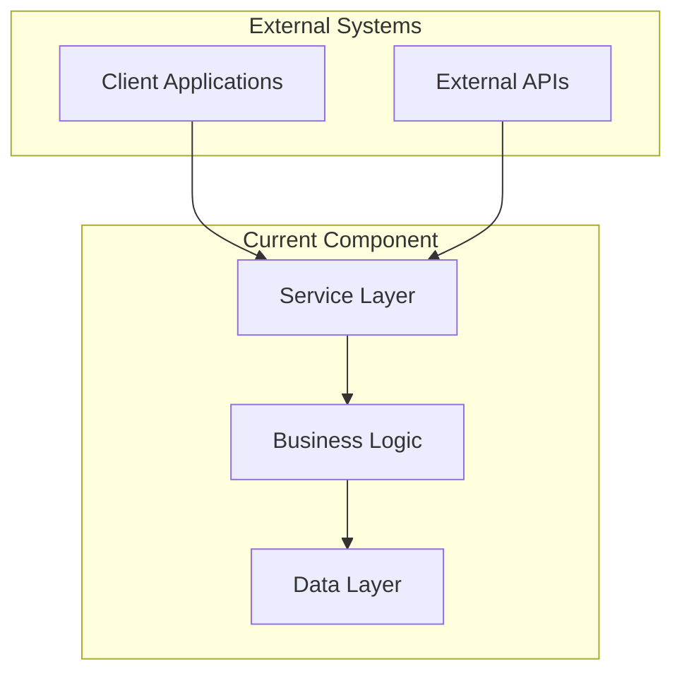
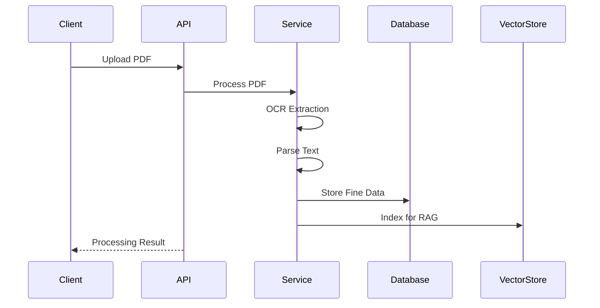

# Technical Specification Template

## Component Overview

**Component Name:** [Component Name]  
**Version:** [Version Number]  
**Last Updated:** [Date]  
**Owner:** [Team/Person]  
**Status:** [Draft/Active/Deprecated]  

---

## 1. Purpose and Scope

### Purpose
[Explain what this component does and why it exists]

### Scope
- **In Scope:** [What this component covers]
- **Out of Scope:** [What this component does not cover]

### Dependencies
- [List key dependencies and why they are needed]
- [Note any external dependencies or services]

## 2. Architecture Overview

### Component Diagram


### Technology Stack
| Layer | Technology | Version | Justification |
|-------|------------|---------|---------------|
| Runtime | Python | 3.8+ | [Reason for choice] |
| Framework | FastAPI | Latest | [Reason for choice] |
| Database | SQLite → PostgreSQL | 3.x → 13+ | [Migration rationale] |
| Document Processing | pytesseract, easyocr | Latest | [OCR capabilities needed] |
| AI/ML | Google Generative AI | Latest | [AI requirements] |
| Vector Store | FAISS | Latest | [Vector search needs] |

## 3. Functional Requirements

### Core Features

#### Feature 1: [Feature Name]
**Priority:** [High/Medium/Low]  
**Description:** [What the feature does]

**Functional Requirements:**
- FR1: [Specific functional requirement]
- FR2: [Another requirement]

**Acceptance Criteria:**
- AC1: [Condition that must be met]
- AC2: [Another condition]

**Example Usage:**
```python
# Code example showing how this feature works
def example_usage():
    pass
```

#### Feature 2: [Feature Name]
[Repeat structure for each major feature]

### Data Requirements

#### Data Models
**Fine Model:**
```python
class Fine(Base):
    id: int
    date: date
    location: string
    infractor: string
    fine_amount: float
    infraction_code: string
    pdf_reference: string
```

**LegalDocument Model:**
```python
class LegalDocument(Base):
    id: int
    title: string
    document_type: string  # law, precedent, defense, regulation
    jurisdiction: string
    publication_date: date
    source_url: string
    quality_score: float
```

#### Data Flow


## 4. Non-Functional Requirements

### Performance
- **Response Time:** [Maximum response time requirement]
- **Throughput:** [Expected request volume]
- **Scalability:** [How system scales with load]

**Performance Targets:**
| Metric | Target | Measurement Method |
|--------|--------|-------------------|
| PDF Processing | < 30 seconds | End-to-end processing time |
| API Response | < 200ms | P95 response time |
| Vector Search | < 100ms | Query response time |
| Database Queries | < 50ms | P95 query execution time |

### Reliability
- **Availability:** [Target uptime percentage]
- **Data Durability:** [Backup and recovery requirements]
- **Error Handling:** [How errors are handled and reported]

### Security
- **Data Protection:** [How sensitive data is protected]
- **Access Control:** [Authentication and authorization requirements]
- **Input Validation:** [How inputs are validated and sanitized]

### Compatibility
- **File Formats:** [Supported file formats and versions]
- **Browser Support:** [If applicable]
- **API Compatibility:** [Backward compatibility requirements]

## 5. Implementation Details

### API Design

#### Endpoint Structure
```
POST   /api/v1/fines/          # Create new fine
GET    /api/v1/fines/          # List fines
GET    /api/v1/fines/{id}      # Get fine by ID
DELETE /api/v1/fines/{id}      # Delete fine

POST   /api/v1/defenses/       # Generate defense
GET    /api/v1/defenses/{id}   # Get defense by ID
```

#### Request/Response Examples

**Create Fine Request:**
```json
POST /api/v1/fines/
{
  "date": "2025-11-11",
  "location": "Lisbon",
  "infractor": "John Doe",
  "fine_amount": 150.00,
  "infraction_code": "A123"
}
```

**Create Fine Response:**
```json
{
  "success": true,
  "data": {
    "id": 1,
    "date": "2025-11-11",
    "location": "Lisbon",
    "infractor": "John Doe",
    "fine_amount": 150.00,
    "infraction_code": "A123",
    "created_at": "2025-11-11T15:44:09.050Z"
  }
}
```

### Database Schema

#### Tables Structure
```sql
-- Fine records
CREATE TABLE fines (
    id INTEGER PRIMARY KEY,
    date DATE NOT NULL,
    location VARCHAR(255) NOT NULL,
    infractor VARCHAR(255) NOT NULL,
    fine_amount DECIMAL(10,2) NOT NULL,
    infraction_code VARCHAR(50) NOT NULL,
    pdf_reference VARCHAR(500),
    created_at TIMESTAMP DEFAULT CURRENT_TIMESTAMP
);

-- Legal documents for RAG
CREATE TABLE legal_documents (
    id INTEGER PRIMARY KEY,
    title VARCHAR(500) NOT NULL,
    document_type VARCHAR(100) NOT NULL,
    jurisdiction VARCHAR(100) NOT NULL,
    publication_date DATE,
    source_url VARCHAR(1000) UNIQUE,
    file_path VARCHAR(1000),
    extracted_text TEXT,
    quality_score DECIMAL(3,2) DEFAULT 0.0,
    relevance_score DECIMAL(3,2) DEFAULT 0.0,
    freshness_score DECIMAL(3,2) DEFAULT 0.0,
    authority_score DECIMAL(3,2) DEFAULT 0.0,
    created_at TIMESTAMP DEFAULT CURRENT_TIMESTAMP
);
```

### Error Handling

#### Error Categories
| Error Type | HTTP Code | Description | Example |
|------------|-----------|-------------|---------|
| Validation Error | 422 | Invalid input data | Missing required field |
| Authentication Error | 401 | Invalid API key | Missing or invalid token |
| Not Found | 404 | Resource not exists | Non-existent fine ID |
| Rate Limit | 429 | Too many requests | Exceeded API limits |
| Internal Error | 500 | Server error | Database connection failure |

#### Error Response Format
```json
{
  "success": false,
  "error": {
    "code": "VALIDATION_ERROR",
    "message": "Invalid input data",
    "details": {
      "field": "fine_amount",
      "issue": "Must be a positive number"
    }
  },
  "timestamp": "2025-11-11T15:44:09.050Z"
}
```

## 6. Configuration

### Environment Variables
```bash
# Database
DATABASE_URL=sqlite:///./finehero.db

# AI Services
GOOGLE_API_KEY=your_google_api_key

# Application
APP_NAME=FineHero AI
ENVIRONMENT=development

# OCR Settings
TESSERACT_CMD=/usr/bin/tesseract
```

### Configuration File Structure
```python
class Settings(BaseSettings):
    APP_NAME: str = "FineHero AI"
    DATABASE_URL: str = "sqlite:///./finehero.db"
    GOOGLE_API_KEY: Optional[str] = None
    ENVIRONMENT: str = "development"
    
    # OCR Configuration
    TESSERACT_CMD: str = "/usr/bin/tesseract"
    EASYOCR_MODEL_PATH: Optional[str] = None
    
    # RAG Configuration
    VECTOR_STORE_DIR: str = "vector_store"
    KNOWLEDGE_BASE_DIR: str = "knowledge_base"
```

## 7. Testing Strategy

### Unit Testing
- [ ] Service layer testing with mocked dependencies
- [ ] Database model testing
- [ ] API endpoint testing

### Integration Testing
- [ ] End-to-end PDF processing pipeline
- [ ] Database integration testing
- [ ] External API integration testing

### Performance Testing
- [ ] Load testing for concurrent users
- [ ] Stress testing for peak loads
- [ ] Memory usage monitoring

### Test Coverage Targets
- **Unit Tests:** > 90% code coverage
- **Integration Tests:** All critical paths covered
- **Performance Tests:** Response times within targets

## 8. Deployment

### Deployment Strategy
**Environment:** Docker containerized deployment  
**Orchestration:** Docker Compose for development, Kubernetes for production  
**CI/CD:** GitHub Actions with automated testing and deployment  

### Deployment Steps
1. **Build Application**
   ```bash
   docker build -t finehero-api:latest .
   ```

2. **Deploy Database Migrations**
   ```bash
   python backend/database_migrations.py
   ```

3. **Deploy Application**
   ```bash
   docker-compose up -d
   ```

### Monitoring and Logging
- **Application Logs:** Structured JSON logging
- **Performance Metrics:** Response times, throughput
- **Error Tracking:** Automated error reporting
- **Health Checks:** `/health` endpoint for monitoring

## 9. Maintenance and Operations

### Routine Maintenance
- **Database Backups:** Daily automated backups
- **Log Rotation:** Weekly log cleanup
- **Security Updates:** Monthly dependency updates
- **Performance Reviews:** Quarterly performance assessments

### Troubleshooting Guide
- **Common Issues:** [List of frequent problems and solutions]
- **Debug Commands:** [Useful debugging commands]
- **Log Locations:** [Where to find relevant logs]

### Scaling Considerations
- **Horizontal Scaling:** Load balancer with multiple API instances
- **Database Scaling:** Read replicas for query performance
- **Vector Store Scaling:** Distributed vector storage for large knowledge bases

## 10. Future Enhancements

### Planned Features
- [ ] Multi-language support for defense generation
- [ ] Advanced OCR with higher accuracy models
- [ ] Integration with additional legal databases
- [ ] Real-time processing pipeline

### Technical Debt
- [ ] Migrate from SQLite to PostgreSQL for production
- [ ] Implement proper logging and monitoring
- [ ] Add comprehensive error handling
- [ ] Implement caching for frequently accessed data

---

**Document Version:** 1.0  
**Last Review Date:** [Date]  
**Next Review Date:** [Date]  
**Approval Status:** [Pending/Approved]  
**Distribution:** Development Team, QA Team, Product Team