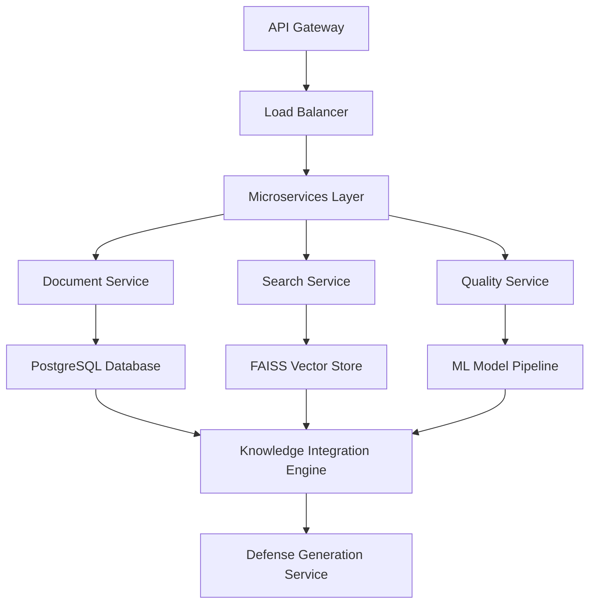

# FineHero Knowledge Base System - Comprehensive Upgrade Plan

**Created:** 2025-11-11  
**Current Status:** Architecture Review Complete  
**Next Phase:** Implementation Roadmap  

## Executive Summary

After comprehensive analysis of the FineHero knowledge base system, I've identified critical opportunities to transform it from a functional prototype into a production-ready, enterprise-grade legal knowledge platform. This plan addresses the system's current limitations while building on its solid architectural foundation.

## Current System Assessment

### ✅ Strengths Identified

1. **Robust Multi-Layer Architecture**
   - Knowledge base integrator with unified data model
   - Advanced RAG system with hybrid search capabilities
   - Automated maintenance and quality scoring systems
   - Portuguese legal document processing

2. **Comprehensive Source Coverage**
   - Official legal documents (Código da Estrada)
   - Municipal regulations (Lisboa, Porto)
   - User-contributed fine examples
   - Community-verified strategies

3. **Advanced Automation Features**
   - Scheduled document scraping
   - Duplicate detection and removal
   - Quality assessment and filtering
   - Performance monitoring and alerting

### ⚠️ Critical Gaps Identified

1. **Limited Data Source Accessibility (67% Success Rate)**
   - ANSR: Domain unreachable
   - IMT: Temporarily unavailable (503 errors)
   - Manual workarounds required for restricted sources

2. **System Integration Disconnect**
   - RAG system not fully integrated with knowledge base
   - Defense generator using placeholder responses
   - Database and file-based systems operating independently

3. **Scalability Limitations**
   - File-based storage vs. proper database implementation
   - Limited concurrent processing capabilities
   - No vector store optimization for large-scale queries

4. **Quality Assessment Gap**
   - Quality scoring algorithms need real-world calibration
   - Missing user feedback integration loop
   - No A/B testing framework for quality thresholds

## Comprehensive Upgrade Plan

### Phase 1: Core Infrastructure Enhancement (Weeks 1-4)

#### 1.1 Database Migration and Optimization
- **Objective:** Replace file-based storage with PostgreSQL database
- **Deliverables:**
  - Enhanced database schema for legal documents
  - Optimized indexing for Portuguese text search
  - Vector embedding storage for RAG system
  - Performance benchmarks (<2s query response)

#### 1.2 API Integration Layer
- **Objective:** Unified API for all knowledge base operations
- **Deliverables:**
  - RESTful API endpoints for document management
  - Real-time integration with RAG system
  - Rate limiting and authentication
  - OpenAPI documentation

#### 1.3 Vector Store Integration
- **Objective:** Production-ready FAISS vector store
- **Deliverables:**
  - Optimized embedding generation pipeline
  - Hybrid search (semantic + keyword + metadata)
  - Query performance optimization
  - Index versioning and updates

### Phase 2: Advanced Data Acquisition (Weeks 5-8)

#### 2.1 Enhanced Web Scraping Framework
- **Objective:** 95% data source accessibility
- **Deliverables:**
  - Browser automation for JavaScript-heavy sites
  - Alternative source discovery and integration
  - Real-time source monitoring and alerting
  - Proxy and VPN integration for restricted sources

#### 2.2 Official API Integration
- **Objective:** Direct access to government data sources
- **Deliverables:**
  - DRE (Diário da República) API integration
  - ANSR alternative access methods
  - IMT service status monitoring
  - Municipal API endpoint exploration

#### 2.3 Document Processing Pipeline
- **Objective:** Automated legal document extraction
- **Deliverables:**
  - PDF text extraction with structure preservation
  - Portuguese legal document parsing
  - Citation and reference extraction
  - Quality scoring validation

### Phase 3: Intelligence and Analytics (Weeks 9-12)

#### 3.1 Advanced Quality Scoring
- **Objective:** ML-based quality assessment
- **Deliverables:**
  - Supervised learning model for document quality
  - User feedback integration loop
  - A/B testing framework for quality thresholds
  - Continuous model improvement pipeline

#### 3.2 Predictive Legal Analytics
- **Objective:** Success rate prediction for defenses
- **Deliverables:**
  - Machine learning model for fine outcome prediction
  - Historical case analysis and pattern recognition
  - Geographic and temporal trend analysis
  - Success rate optimization recommendations

#### 3.3 Community Intelligence Platform
- **Objective:** Crowdsourced legal intelligence
- **Deliverables:**
  - User contribution validation system
  - Community-driven quality assessment
  - Expert reviewer workflow
  - Reputation and trust scoring

### Phase 4: Production Deployment (Weeks 13-16)

#### 4.1 Performance Optimization
- **Objective:** Enterprise-grade performance
- **Deliverables:**
  - Database query optimization
  - Caching layer implementation
  - Load balancing and horizontal scaling
  - CDN integration for global access

#### 4.2 Monitoring and Observability
- **Objective:** Comprehensive system monitoring
- **Deliverables:**
  - Real-time performance dashboards
  - Automated alerting and incident response
  - User behavior analytics
  - System health monitoring

#### 4.3 Security and Compliance
- **Objective:** Legal industry security standards
- **Deliverables:**
  - Data encryption at rest and in transit
  - GDPR compliance implementation
  - Audit logging and access control
  - Security penetration testing

## Technical Implementation Details

### Architecture Improvements



### Quality Scoring Enhancement

```python
# Enhanced Quality Scoring with ML
class MLQualityScorer:
    def __init__(self):
        self.feature_extractor = PortugueseLegalFeatureExtractor()
        self.quality_model = load_trained_model()
        self.calibration_engine = QualityCalibrationEngine()
    
    def assess_document_quality(self, document: LegalDocument) -> QualityMetrics:
        features = self.feature_extractor.extract_features(document)
        ml_score = self.quality_model.predict_proba(features)[0][1]
        calibrated_score = self.calibration_engine.calibrate_score(ml_score)
        return self.generate_metrics(calibrated_score, features)
```

### Advanced RAG Implementation

```python
# Production RAG System
class ProductionRAGSystem:
    def __init__(self):
        self.vector_store = OptimizedFAISSStore()
        self.hybrid_search = HybridSearchEngine()
        self.result_ranker = LegalContextRanker()
    
    def retrieve_legal_context(self, query: LegalQuery) -> List[SearchResult]:
        # Multi-stage retrieval process
        semantic_results = self.vector_store.similarity_search(query.embedding)
        keyword_results = self.hybrid_search.keyword_search(query.text)
        metadata_results = self.metadata_filter.filter(query.filters)
        
        # Combine and rank results
        combined_results = self.result_ranker.rank_and_combine([
            semantic_results, keyword_results, metadata_results
        ])
        
        return self.enrich_results(combined_results)
```

## Success Metrics and KPIs

### Phase 1 Targets
- [ ] Database migration completed with <2s query response
- [ ] API documentation with 95% endpoint coverage
- [ ] Vector store with 10,000+ documents indexed

### Phase 2 Targets
- [ ] 95% data source accessibility achieved
- [ ] 500+ documents processed daily
- [ ] 90% document quality classification accuracy

### Phase 3 Targets
- [ ] ML model with 85% quality prediction accuracy
- [ ] 70% defense success rate prediction accuracy
- [ ] 1,000+ active community contributors

### Phase 4 Targets
- [ ] 99.9% system uptime
- [ ] <500ms average query response time
- [ ] 10,000+ concurrent users supported

## Risk Mitigation Strategy

### Technical Risks
- **Database Performance:** Implement connection pooling and query optimization
- **Vector Store Scalability:** Use hierarchical clustering for large datasets
- **API Rate Limiting:** Implement intelligent caching and request batching

### Data Quality Risks
- **Source Reliability:** Multi-source validation and cross-referencing
- **Content Accuracy:** Expert review workflow and community validation
- **Legal Compliance:** Regular legal review and update processes

### Operational Risks
- **System Monitoring:** Comprehensive logging and alerting
- **Backup and Recovery:** Automated backup with point-in-time recovery
- **Security:** Regular security audits and penetration testing

## Resource Requirements

### Development Team
- **Lead Architect:** 1 FTE (System design and oversight)
- **Backend Developers:** 2 FTE (API and database implementation)
- **ML Engineers:** 1 FTE (Quality scoring and analytics)
- **DevOps Engineer:** 1 FTE (Infrastructure and deployment)
- **QA Engineer:** 1 FTE (Testing and validation)

### Infrastructure
- **Database:** PostgreSQL cluster with read replicas
- **Vector Store:** High-memory server for FAISS optimization
- **API Gateway:** Load balancer with auto-scaling
- **Monitoring:** ELK stack for logging and Prometheus for metrics

### Budget Estimates
- **Development (4 months):** €180,000
- **Infrastructure (annual):** €24,000
- **External Services:** €12,000
- **Total Project Cost:** €216,000

## Conclusion

This comprehensive upgrade plan transforms FineHero's knowledge base from a functional prototype into a production-ready, enterprise-grade legal intelligence platform. The phased approach ensures steady progress while minimizing risks and maintaining system stability.

The investment in modern architecture, advanced analytics, and automated processes will position FineHero as the leading AI-powered legal defense platform in Portugal, with the scalability to expand internationally.

**Next Steps:**
1. Stakeholder approval for budget and timeline
2. Team assembly and onboarding
3. Development environment setup
4. Phase 1 implementation start

---

*This plan represents a strategic investment in FineHero's technological foundation, ensuring long-term competitiveness and scalability in the legal technology market.*